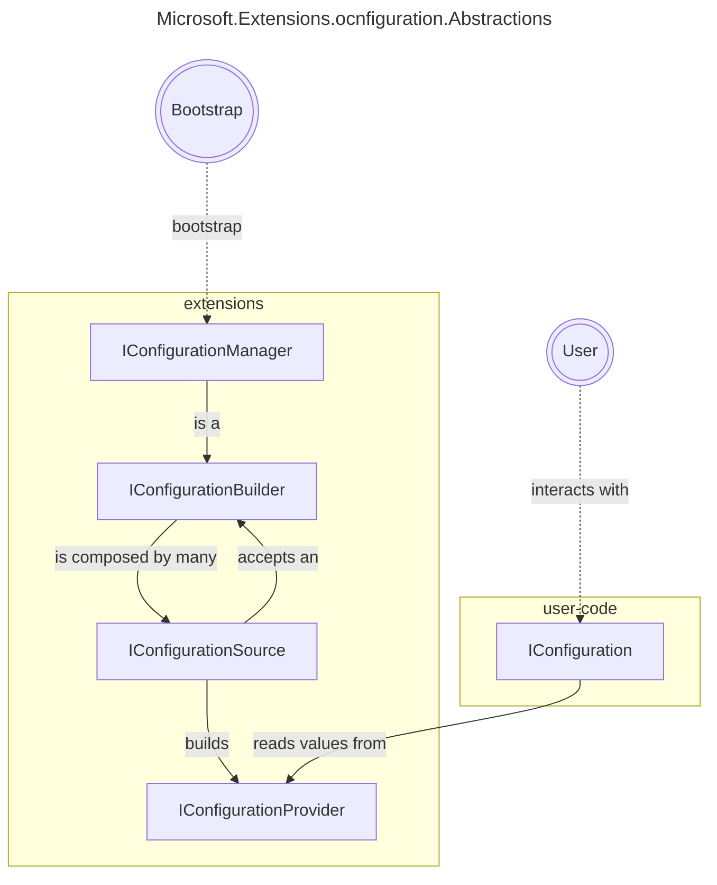

---
tags:
  - csharp
  - configuration
---
# Collaborates with
- `IConfigurationManager IHostApplicationBuilder.Configuration`
# Components



## User Land

- IConfiguration
Represents a set of key/value application configuration properties.
## Bootstrapping

- IConfigurationManager
Act as both an `IConfigurationBuilder` and a `IConfiguration`. As `IConfigurationSource` are added into the builder, it updates the current view of the configuration.

- IConfigurationBuilder
Represents a composition of multiple `IConfigurationSource` and a set of `Properties` dictionary that usually acts as a kind of `IServiceProvider` for the `IConfigurationSource` to read values from.


## Extension

- IConfigurationSource
It is meant to be a builder that gets passed the `IconfigurationBuilder` where it is being used, mainly to access its `Properties` field. At the end it should build an `IConfigurationProvider`

- IConfigurationProvider
Is the thing that the `IConfiguration` actually gets the values from, also it can support `Set(string key, string? value)` so that it can mutate it.

# Plugins
The plugins for configuration usually provides extension methods for the `IConfigurationBuilder` which in its internal implementation adds `IConfigurationSource` into it
## Built-ins
- Json
- Xml
- Ini

```csharp
// they have the following similar api
// ext - stands for file extension

// add a 'required' local file that do not reloads on change
IConfigurationBuilder.AddExtFile(string path);
// configure optionality
IConfigurationBuilder.AddExtFile(string path, bool optional);
// configure reloading it
IConfigurationBuilder.AddExtFile(string path, bool optional, bool reloadOnChange);
// add a json stream, it can come from anywhere, http call or whatever
IConfigurationBuilder.AddExtStream(Stream stream);

```
